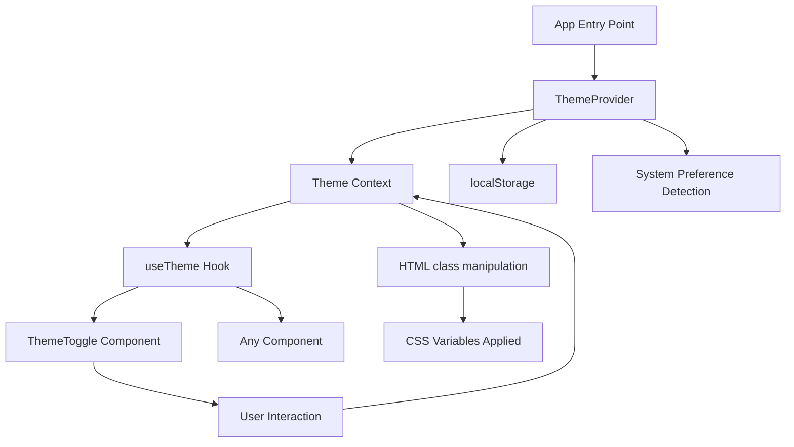

# Dark Mode Feature Design

## Overview

This design implements a complete dark mode system for the Agent UI application. The solution leverages the existing Tailwind CSS dark mode configuration and CSS variables already defined in the codebase. The implementation follows React best practices using Context API for state management, custom hooks for easy consumption, and localStorage for persistence.

The design prioritizes:
- Minimal code footprint by reusing existing CSS infrastructure
- Smooth user experience with transitions and no flash of unstyled content
- Developer experience with a simple, reusable API

## Architecture

### High-Level Architecture



### Component Hierarchy

```
App.tsx
└── ThemeProvider (new)
    ├── Theme Context (new)
    └── App Content
        └── ThemeToggle Button (new)
```

## Components and Interfaces

### 1. Theme Context and Provider

**File:** `src/contexts/ThemeContext.tsx`

**Purpose:** Centralized theme state management using React Context API

**Interface:**
```typescript
type Theme = 'light' | 'dark' | 'system'

interface ThemeContextValue {
  theme: Theme
  setTheme: (theme: Theme) => void
  resolvedTheme: 'light' | 'dark' // The actual applied theme
}
```

**Responsibilities:**
- Initialize theme from localStorage or system preference
- Provide theme state to all child components
- Handle theme changes and persist to localStorage
- Apply theme class to document root element
- Detect and respond to system preference changes

**Implementation Details:**
- Uses `useState` for theme state management
- Uses `useEffect` to sync with localStorage and DOM
- Uses `matchMedia` API to detect system preferences
- Listens to system preference changes via media query listener
- Applies 'dark' class to `document.documentElement` when dark mode is active

### 2. useTheme Hook

**File:** `src/hooks/useTheme.ts`

**Purpose:** Convenient hook for consuming theme context

**Interface:**
```typescript
function useTheme(): ThemeContextValue
```

**Usage Example:**
```typescript
const { theme, setTheme, resolvedTheme } = useTheme()
```

**Error Handling:**
- Throws error if used outside ThemeProvider

### 3. ThemeToggle Component

**File:** `src/components/theme/ThemeToggle.tsx`

**Purpose:** UI control for switching between themes

**Props:**
```typescript
interface ThemeToggleProps {
  className?: string
  showLabel?: boolean
}
```

**Features:**
- Displays sun icon for light mode, moon icon for dark mode
- Uses existing Button component with 'ghost' or 'outline' variant
- Includes Radix UI Dropdown Menu for three-option selection (light/dark/system)

**Visual Design:**
- Icon-only button by default
- Optional text label
- Smooth icon transition on theme change
- Positioned in app header/navigation area

### 4. App Integration

**File:** `src/App.tsx` and `src/main.tsx`

**Changes:**
- Wrap app with ThemeProvider in main.tsx
- Add ThemeToggle button to app header/navigation
- Ensure proper positioning and visibility across all views

## Data Models

### Theme Preference Storage

**Storage Key:** `'theme-preference'`

**Storage Location:** `localStorage`

**Data Format:**
```typescript
type StoredTheme = 'light' | 'dark' | 'system'
```

**Storage Logic:**
- Save on every theme change
- Read on app initialization
- Default to 'system' if no stored value

### System Preference Detection

**Media Query:** `'(prefers-color-scheme: dark)'`

**Detection Logic:**
```typescript
const isDarkMode = window.matchMedia('(prefers-color-scheme: dark)').matches
```

**Listener:**
- Attach listener to respond to OS theme changes
- Only active when theme is set to 'system'
- Clean up listener on component unmount

## Error Handling

### localStorage Unavailable

**Scenario:** User has disabled localStorage or browser doesn't support it

**Handling:**
- Wrap localStorage operations in try-catch blocks
- Fall back to in-memory state only
- Log warning to console
- Continue functioning without persistence

### Context Used Outside Provider

**Scenario:** Component tries to use useTheme outside ThemeProvider

**Handling:**
- Throw descriptive error message
- Guide developer to wrap app with ThemeProvider

### Invalid Stored Theme Value

**Scenario:** localStorage contains corrupted or invalid theme value

**Handling:**
- Validate stored value against allowed themes
- Fall back to 'system' default if invalid
- Clear invalid value from storage

## Testing Strategy

### Manual Testing

- Theme persists across page reloads
- Theme toggle updates entire app appearance
- System preference changes are detected and applied
- Manual theme selection overrides system preference
- No flash of unstyled content on initial load
- Smooth transitions between themes
- All components render correctly in both themes
- Icons and colors are appropriate for each theme
- No visual glitches during theme switch

## Implementation Notes

### Preventing Flash of Unstyled Content (FOUC)

To prevent the flash of wrong theme on page load:

1. **Inline Script in index.html:**
   - Add a small inline script before React loads
   - Read theme from localStorage
   - Apply class to html element immediately
   - This runs before React hydration

```html
<script>
  (function() {
    const theme = localStorage.getItem('theme-preference') || 'system'
    const isDark = theme === 'dark' || 
      (theme === 'system' && window.matchMedia('(prefers-color-scheme: dark)').matches)
    if (isDark) {
      document.documentElement.classList.add('dark')
    }
  })()
</script>
```

### CSS Transitions

Add transition classes to prevent jarring color changes:

```css
/* In index.css */
* {
  transition: background-color 0.2s ease, color 0.2s ease, border-color 0.2s ease;
}

/* Disable transitions on page load */
.no-transitions * {
  transition: none !important;
}
```

Remove 'no-transitions' class after initial render.

### Icon Selection

Use lucide-react icons:
- `Sun` icon for light mode
- `Moon` icon for dark mode
- `Monitor` icon for system preference

### Positioning

Recommended placement:
- Top-right corner of the app header
- Visible on all pages and views
- Consistent position across different screen sizes
- Mobile-friendly with appropriate touch target size

## Design Decisions and Rationales

### Decision 1: Context API vs. State Management Library

**Choice:** React Context API

**Rationale:**
- Theme state is simple and doesn't require complex logic
- Context API is built-in, no additional dependencies
- Sufficient performance for this use case
- Easier to understand and maintain

### Decision 2: Three-Option Theme Selector vs. Simple Toggle

**Choice:** Three options (light/dark/system)

**Rationale:**
- Respects user's system preferences
- Provides explicit control when needed
- Modern UX pattern seen in popular apps
- Minimal additional complexity

### Decision 3: localStorage vs. Cookies

**Choice:** localStorage

**Rationale:**
- No server-side rendering in this app
- localStorage is simpler and more appropriate for client-only state
- No need to send theme preference to server
- Better performance (no network overhead)

### Decision 4: Inline Script for FOUC Prevention

**Choice:** Add inline script to index.html

**Rationale:**
- Only reliable way to prevent flash before React loads
- Minimal performance impact (tiny script)
- Industry standard approach
- Better UX than showing wrong theme briefly

### Decision 5: CSS Variables vs. Tailwind Classes

**Choice:** Leverage existing CSS variables

**Rationale:**
- CSS variables already defined in the codebase
- Tailwind configured to use them
- No need to refactor existing components
- Smooth transitions work better with CSS variables
- Consistent with existing architecture
