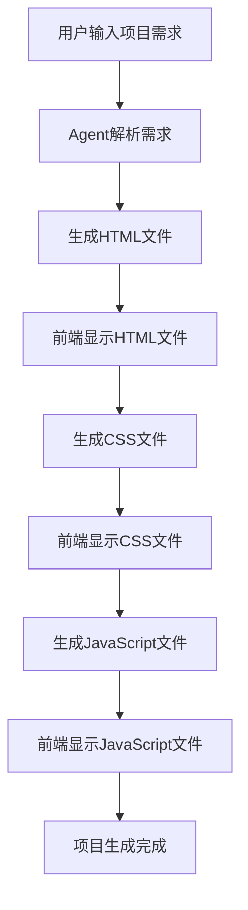

# AI开发者Agent设计文档

## 1. 项目概述

### 1.1 项目目标
设计并实现一个AI开发者Agent，能够根据用户需求自动生成简化版前端项目。该Agent专注于创建包含HTML、CSS、JavaScript三个文件的原生前端项目，不依赖现代化框架。

### 1.2 核心特性
- **顺序生成**：按照HTML → CSS → JavaScript的顺序依次生成文件
- **实时可见**：每生成一个文件后，前端FileBrowser立即显示新文件
- **内存存储**：生成的文件内容存储在前端本地变量中，不依赖服务器文件系统
- **流式响应**：支持实时流式响应，用户可以看到生成过程
- **智能提示词**：针对不同文件类型设计专门的提示词模板

## 2. 系统架构

### 2.1 整体架构图
```
用户请求 → AI开发者Agent → LLM服务 → 文件生成工具 → 前端展示
    ↓              ↓            ↓           ↓           ↓
  描述需求     → 提示词设计  → 内容生成  → 结构化输出 → FileBrowser更新
```

### 2.2 核心组件

#### 2.2.1 AIDeveloperAgent
- 继承自BaseAgent
- 负责协调整个项目生成流程
- 管理文件生成的顺序和依赖关系

#### 2.2.2 CodeGeneratorTool
- 专门用于代码生成的工具
- 支持不同类型文件的生成（HTML/CSS/JS）
- 集成LLM服务进行智能代码生成

#### 2.2.3 ProjectStructureTool
- 管理项目结构和文件关系
- 维护文件间的依赖关系
- 确保生成的文件能够正确协作

## 3. 详细设计

### 3.1 文件生成流程

#### 3.1.1 流程图


#### 3.1.2 详细步骤

1. **需求分析阶段**
   - 解析用户输入的项目描述
   - 提取关键功能和设计要求
   - 生成项目整体规划

2. **HTML生成阶段**
   - 使用HTML专用提示词
   - 生成页面结构和内容
   - 包含必要的meta标签和语义化HTML

3. **CSS生成阶段**
   - 基于生成的HTML结构
   - 创建响应式样式
   - 确保良好的视觉效果

4. **JavaScript生成阶段**
   - 基于HTML结构和CSS样式
   - 添加交互功能
   - 确保代码质量和性能

### 3.2 提示词设计

#### 3.2.1 HTML生成提示词模板
```
作为一个专业的前端开发工程师，请根据以下项目需求生成HTML文件：

项目描述：{project_description}

要求：
1. 使用语义化HTML5标签
2. 包含完整的DOCTYPE和meta标签
3. 结构清晰，便于CSS样式化
4. 预留JavaScript交互元素的ID和class
5. 确保无障碍访问性

请生成完整的HTML代码，包含：
- 完整的文档结构
- 合适的标题和内容区域
- 必要的表单或交互元素
- 适当的注释说明

HTML代码：
```

#### 3.2.2 CSS生成提示词模板
```
作为一个专业的CSS开发工程师，请为以下HTML结构生成对应的CSS样式：

HTML结构：
{html_content}

项目描述：{project_description}

要求：
1. 现代化的视觉设计
2. 响应式布局（支持移动端）
3. 良好的用户体验
4. 使用CSS3特性（如flexbox、grid等）
5. 包含悬停效果和过渡动画
6. 确保浏览器兼容性

请生成完整的CSS代码，包含：
- 基础重置和normalize
- 布局样式
- 颜色和字体定义
- 响应式媒体查询
- 动画效果

CSS代码：
```

#### 3.2.3 JavaScript生成提示词模板
```
作为一个专业的JavaScript开发工程师，请为以下项目生成交互逻辑：

HTML结构：
{html_content}

CSS样式：
{css_content}

项目描述：{project_description}

要求：
1. 使用现代JavaScript语法（ES6+）
2. 良好的代码组织和注释
3. 错误处理和边界情况考虑
4. 性能优化
5. 用户友好的交互体验

请生成完整的JavaScript代码，包含：
- DOM操作和事件处理
- 数据验证和处理
- 动态内容更新
- 用户交互反馈
- 必要的工具函数

JavaScript代码：
```

### 3.3 数据模型

#### 3.3.1 项目数据结构
```python
class SimpleProject:
    project_id: str
    name: str
    description: str
    files: Dict[str, SimpleFile]
    status: ProjectStatus
    created_at: datetime
    updated_at: datetime

class SimpleFile:
    name: str
    type: FileType  # html, css, js
    content: str
    status: FileStatus  # generating, ready, error
    generated_at: datetime

enum ProjectStatus:
    PLANNING = "planning"
    GENERATING_HTML = "generating_html"
    GENERATING_CSS = "generating_css"
    GENERATING_JS = "generating_js"
    COMPLETED = "completed"
    ERROR = "error"

enum FileType:
    HTML = "html"
    CSS = "css"
    JAVASCRIPT = "js"
```

### 3.4 API设计

#### 3.4.1 创建项目接口
```http
POST /api/ai-developer/create-project
Content-Type: application/json

{
    "description": "创建一个简单的待办事项管理网页",
    "requirements": [
        "添加新待办事项",
        "标记完成状态",
        "删除待办事项",
        "响应式设计"
    ],
    "style": "modern",
    "theme": "blue"
}
```

#### 3.4.2 流式响应格式
```javascript
// 项目开始
data: {
    "type": "project_start",
    "data": {
        "projectId": "proj_123",
        "status": "planning"
    }
}

// HTML生成开始
data: {
    "type": "file_generation_start",
    "data": {
        "fileType": "html",
        "fileName": "index.html"
    }
}

// HTML内容流式返回
data: {
    "type": "file_content_chunk",
    "data": {
        "fileType": "html",
        "content": "<!DOCTYPE html>\n<html>..."
    }
}

// HTML生成完成
data: {
    "type": "file_generation_complete",
    "data": {
        "fileType": "html",
        "fileName": "index.html",
        "content": "完整的HTML内容",
        "status": "ready"
    }
}

// 项目完成
data: {
    "type": "project_complete",
    "data": {
        "projectId": "proj_123",
        "files": {
            "index.html": {...},
            "style.css": {...},
            "script.js": {...}
        }
    }
}
```

## 4. 技术实现

### 4.1 后端实现

#### 4.1.1 AIDeveloperAgent实现要点
```python
class AIDeveloperAgent(BaseAgent):
    async def process_message(self, message: str, session_id: str, **kwargs):
        # 1. 解析项目需求
        project_spec = await self._parse_requirements(message)
        
        # 2. 按顺序生成文件
        for file_type in ["html", "css", "js"]:
            yield self.create_tool_start_event(
                f"code_generator_{file_type}",
                f"正在生成{file_type.upper()}文件...",
                f"{file_type}_gen"
            )
            
            # 生成文件内容
            content = await self._generate_file_content(
                file_type, project_spec
            )
            
            # 流式返回内容
            async for chunk in content:
                yield self.create_text_chunk_event(chunk, message_id)
            
            yield self.create_tool_end_event(
                f"{file_type}_gen",
                "success",
                f"{file_type.upper()}文件生成完成"
            )
```

#### 4.1.2 CodeGeneratorTool实现要点
```python
class CodeGeneratorTool(BaseTool):
    async def execute(self, parameters: Dict[str, Any]):
        file_type = parameters["file_type"]
        project_description = parameters["project_description"]
        context = parameters.get("context", {})
        
        # 选择合适的提示词模板
        prompt = self._build_prompt(file_type, project_description, context)
        
        # 调用LLM生成代码
        content = await self.llm_service.generate_code_stream(prompt)
        
        return {
            "file_type": file_type,
            "content": content,
            "status": "success"
        }
```

### 4.2 前端集成

#### 4.2.1 FileBrowser更新机制
- 监听SSE事件流
- 接收到新文件生成完成事件时，更新本地文件数据
- 实时刷新FileBrowser组件显示

#### 4.2.2 内存文件管理
```typescript
interface ProjectFileManager {
    files: Map<string, SimpleFile>;
    updateFile(name: string, content: string, type: FileType): void;
    getFile(name: string): SimpleFile | undefined;
    getAllFiles(): SimpleFile[];
}
```

## 5. 测试策略

### 5.1 单元测试
- 测试各个工具的独立功能
- 测试提示词模板的正确性
- 测试文件生成逻辑

### 5.2 集成测试
- 测试完整的项目生成流程
- 测试多工具协调功能
- 测试错误处理机制

### 5.3 端到端测试
- 测试从用户输入到前端显示的完整流程
- 测试生成文件的质量和可用性
- 测试用户体验和性能

## 6. 部署和运维

### 6.1 性能优化
- LLM调用的并发控制
- 内容缓存策略
- 流式响应优化

### 6.2 错误处理
- 生成失败的重试机制
- 部分生成成功的处理
- 用户友好的错误提示

### 6.3 监控和日志
- 生成成功率监控
- 性能指标追踪
- 用户行为分析

## 7. 未来扩展

### 7.1 功能扩展
- 支持更多文件类型（如Markdown、JSON配置）
- 支持项目模板和预设
- 支持代码优化和重构建议

### 7.2 技术扩展
- 支持现代化框架项目生成
- 集成代码质量检查工具
- 支持项目部署和预览功能

---

*本设计文档定义了AI开发者Agent的完整架构和实现方案，为后续开发提供详细指导。*