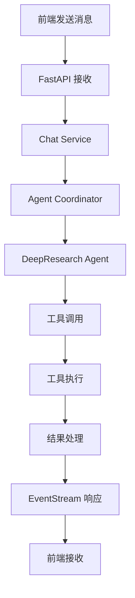

# Agent UI 后端架构设计文档

## 项目概述

基于 FastAPI + LangChain 构建的智能对话后端系统，支持多轮对话、工具调用协调和实时流式响应。主要实现 DeepResearch Agent 功能，通过 HTTP EventStream 与前端进行实时交互。

## 技术栈

### 核心框架
- **FastAPI**: 高性能异步 Web 框架，提供 API 接口和 EventStream 支持
- **LangChain**: 大语言模型应用开发框架，负责 Agent 逻辑和工具调用
- **Python 3.11+**: 编程语言，使用 pyenv 管理版本
- **uv**: 现代化Python包管理器，快速依赖管理和虚拟环境

### 主要依赖
- **langchain**: 核心 Agent 框架
- **langchain-openai**: OpenAI 模型集成
- **langchain-community**: 社区工具集成
- **fastapi**: Web 框架
- **uvicorn**: ASGI 服务器
- **pydantic**: 数据验证和序列化
- **httpx**: 异步 HTTP 客户端
- **beautifulsoup4**: HTML 解析
- **python-dotenv**: 环境变量管理

## 项目结构

```
backend/
├── pyproject.toml            # uv 项目配置
├── uv.lock                   # 依赖锁定文件
├── .env.example              # 环境变量示例
├── .env                      # 环境变量配置
├── .gitignore                # Git 忽略文件
├── README.md                 # 项目说明
├── requirements.txt          # pip 兼容依赖文件（可选）
│
├── app/                       # 主应用目录
│   ├── __init__.py
│   ├── main.py               # FastAPI 应用入口
│   ├── config.py             # 配置管理
│   ├── dependencies.py       # FastAPI 依赖注入
│   │
│   ├── api/                  # API 路由
│   │   ├── __init__.py
│   │   ├── chat.py          # 对话相关接口
│   │   └── health.py        # 健康检查接口
│   │
│   ├── agents/               # LangChain Agent 实现
│   │   ├── __init__.py
│   │   ├── base.py          # 基础 Agent 类
│   │   ├── deepresearch.py  # DeepResearch Agent
│   │   └── coordinator.py   # 多 Agent 协调器
│   │
│   ├── tools/                # 工具实现
│   │   ├── __init__.py
│   │   ├── base.py          # 基础工具类
│   │   ├── web_search.py    # 网页搜索工具
│   │   ├── web_content.py   # 网页内容读取工具
│   │   └── registry.py      # 工具注册器
│   │
│   ├── models/               # 数据模型
│   │   ├── __init__.py
│   │   ├── chat.py          # 对话相关模型
│   │   ├── tool.py          # 工具相关模型
│   │   └── response.py      # 响应模型
│   │
│   ├── services/             # 业务逻辑服务
│   │   ├── __init__.py
│   │   ├── chat_service.py  # 对话服务
│   │   ├── stream_service.py # 流式响应服务
│   │   └── session_service.py # 会话管理服务
│   │
│   ├── core/                 # 核心功能
│   │   ├── __init__.py
│   │   ├── events.py        # 事件系统
│   │   ├── exceptions.py    # 异常处理
│   │   ├── logging.py       # 日志配置
│   │   └── middleware.py    # 中间件
│   │
│   └── utils/                # 工具函数
│       ├── __init__.py
│       ├── http.py          # HTTP 工具
│       ├── text.py          # 文本处理
│       └── validation.py    # 数据验证
│
├── tests/                    # 测试代码
│   ├── __init__.py
│   ├── conftest.py          # pytest 配置
│   ├── test_api/            # API 测试
│   ├── test_agents/         # Agent 测试
│   └── test_tools/          # 工具测试
│
├── scripts/                  # 脚本文件
│   ├── start_dev.py         # 开发启动脚本
│   ├── setup_env.py         # 环境设置脚本
│   └── test_tools.py        # 工具测试脚本
│
└── docs/                     # 文档
    ├── API.md               # API 文档
    ├── DEPLOYMENT.md        # 部署文档
    └── DEVELOPMENT.md       # 开发文档
```

## 核心架构设计

### 1. Agent 系统架构

```python
# 基础 Agent 架构
BaseAgent
├── DeepResearchAgent        # 深度研究 Agent
│   ├── web_search          # 网页搜索能力
│   ├── web_content         # 网页内容提取
│   ├── content_analysis    # 内容分析
│   └── summary_generation  # 摘要生成
│
├── CodeAnalysisAgent       # 代码分析 Agent（扩展）
└── MultiModalAgent         # 多模态 Agent（扩展）
```

### 2. 工具系统架构

```python
# 工具注册和调用系统
ToolRegistry
├── WebSearchTool           # 网页搜索工具
├── WebContentTool          # 网页内容提取工具
├── ContentAnalysisTool     # 内容分析工具
└── SummaryTool            # 摘要生成工具
```

### 3. 数据流设计



## API 设计

### 1. EventStream 对话接口

```http
POST /api/chat/stream
Content-Type: application/json

{
  "message": "帮我搜索大冰《他们最幸福》的相关信息",
  "session_id": "optional-session-id",
  "config": {
    "stream": true,
    "tools_enabled": true
  }
}
```

### 2. EventStream 响应格式

```javascript
// 工具调用开始事件
data: {"type": "tool_call_start", "data": {"tool_name": "web_search", "tool_id": "123", "message": "搜索大冰《他们最幸福》相关信息..."}}

// 工具调用完成事件
data: {"type": "tool_call_end", "data": {"tool_id": "123", "status": "success", "result": "找到3个相关结果", "metadata": {...}}}

// 文本流式响应
data: {"type": "text_chunk", "data": {"content": "根据搜索结果，我为您整理了", "message_id": "456"}}

// 完整消息事件
data: {"type": "message_complete", "data": {"message_id": "456", "content": "完整内容..."}}

// 会话结束事件
data: {"type": "session_end", "data": {"session_id": "789"}}
```

## 数据模型设计

### 1. 消息模型

```python
class MessageModel(BaseModel):
    id: str
    sender: Literal["user", "assistant", "system"]
    type: Literal["text", "tool_call"]
    content: Union[TextContent, ToolCallContent]
    timestamp: datetime
    status: Literal["pending", "sent", "delivered", "failed"]
    metadata: Optional[Dict[str, Any]] = None

class TextContent(BaseModel):
    text: str

class ToolCallContent(BaseModel):
    tool_call: ToolCallDetails

class ToolCallDetails(BaseModel):
    id: str
    name: str
    type: str
    status: Literal["running", "success", "error"]
    parameters: Optional[Dict[str, Any]] = None
    result: Optional[str] = None
    metadata: Optional[Dict[str, Any]] = None
    duration: Optional[float] = None
    start_time: Optional[datetime] = None
    end_time: Optional[datetime] = None
```

### 2. 工具数据模型

```python
class WebSearchData(BaseModel):
    query: str
    results: List[WebSearchResultItem]
    search_time: Optional[float] = None
    total_results: Optional[int] = None

class WebSearchResultItem(BaseModel):
    title: str
    url: str
    summary: str
    favicon: Optional[str] = None
    domain: Optional[str] = None

class WebContentData(BaseModel):
    url: str
    title: str
    content: str
    images: Optional[List[ImageInfo]] = None
    summary: Optional[str] = None
    metadata: Optional[ContentMetadata] = None
    status: Literal["success", "partial", "failed"]
    error: Optional[str] = None
```

## DeepResearch Agent 实现

### 1. Agent 工作流程

```python
class DeepResearchAgent:
    def __init__(self):
        self.tools = [WebSearchTool(), WebContentTool()]
        self.llm = ChatOpenAI(model="gpt-4")
        
    async def research(self, query: str, session_id: str):
        # 1. 分析查询意图
        intent = await self.analyze_intent(query)
        
        # 2. 制定研究计划
        plan = await self.create_research_plan(intent)
        
        # 3. 执行研究步骤
        results = []
        for step in plan.steps:
            result = await self.execute_step(step, session_id)
            results.append(result)
            
        # 4. 综合分析和总结
        summary = await self.synthesize_results(results)
        
        return summary
```

### 2. 工具调用协调

```python
class ToolCoordinator:
    async def execute_tool(self, tool_name: str, params: dict, session_id: str):
        # 发送工具开始事件
        await self.send_tool_start_event(tool_name, params)
        
        try:
            # 执行工具
            tool = self.get_tool(tool_name)
            result = await tool.execute(params)
            
            # 发送工具完成事件
            await self.send_tool_end_event(tool_name, "success", result)
            
            return result
        except Exception as e:
            # 发送工具错误事件
            await self.send_tool_end_event(tool_name, "error", str(e))
            raise
```

## 环境配置

### 1. 环境变量配置

```bash
# .env 文件
OPENAI_API_KEY=your_openai_api_key
OPENAI_BASE_URL=https://api.openai.com/v1

# 搜索引擎配置
SEARCH_ENGINE_API_KEY=your_search_api_key
SEARCH_ENGINE_ID=your_search_engine_id

# 应用配置
DEBUG=True
LOG_LEVEL=INFO
HOST=0.0.0.0
PORT=8000

# CORS 配置
CORS_ORIGINS=["http://localhost:3000", "http://localhost:5173"]
```

### 2. uv 配置

```toml
# pyproject.toml
[project]
name = "agent-ui-backend"
version = "0.1.0"
description = "Agent UI Backend with FastAPI and LangChain"
authors = [
    {name = "Agent UI Team", email = "team@agentui.dev"}
]
readme = "README.md"
requires-python = ">=3.11"
dependencies = [
    "fastapi>=0.104.1",
    "uvicorn[standard]>=0.24.0",
    "langchain>=0.0.340",
    "langchain-openai>=0.0.2",
    "langchain-community>=0.0.10",
    "pydantic>=2.5.0",
    "httpx>=0.25.2",
    "beautifulsoup4>=4.12.2",
    "python-dotenv>=1.0.0",
    "python-multipart>=0.0.6",
    "googlesearch-python>=1.2.3",
    "requests>=2.31.0",
    "aiofiles>=23.2.1",
    "python-json-logger>=2.0.7",
    "psutil>=5.9.6",
]

[project.optional-dependencies]
dev = [
    "pytest>=7.4.3",
    "pytest-asyncio>=0.21.1",
    "pytest-cov>=4.1.0",
    "black>=23.11.0",
    "isort>=5.12.0",
    "flake8>=6.1.0",
    "mypy>=1.7.1",
]

[build-system]
requires = ["hatchling"]
build-backend = "hatchling.build"

[tool.black]
line-length = 88
target-version = ['py311']

[tool.isort]
profile = "black"
multi_line_output = 3
line_length = 88
known_first_party = ["app"]

[tool.mypy]
python_version = "3.11"
warn_return_any = true
warn_unused_configs = true
disallow_untyped_defs = true

[tool.pytest.ini_options]
testpaths = ["tests"]
python_files = ["test_*.py"]
python_classes = ["Test*"]
python_functions = ["test_*"]
addopts = "-v --tb=short"
asyncio_mode = "auto"
```

## 开发流程

### 1. 环境设置

```bash
# 安装 uv (如果尚未安装)
# Windows (PowerShell)
powershell -c "irm https://astral.sh/uv/install.ps1 | iex"
# Linux/macOS
curl -LsSf https://astral.sh/uv/install.sh | sh

# 使用 pyenv 设置 Python 版本
pyenv install 3.11.7
pyenv local 3.11.7

# 初始化项目
uv init --python 3.11

# 创建虚拟环境并安装依赖
uv venv
uv pip install -r requirements.txt

# 激活虚拟环境
# Windows (Git Bash)
source .venv/Scripts/activate
# Linux/macOS
source .venv/bin/activate

# 设置环境变量
cp .env.example .env
# 编辑 .env 文件，填入必要的 API 密钥
```

### 2. 启动开发服务器

```bash
# 激活虚拟环境
source .venv/Scripts/activate  # Windows (Git Bash)
# source .venv/bin/activate    # Linux/macOS

# 启动开发服务器
uv run uvicorn app.main:app --host 0.0.0.0 --port 8000 --reload

# 或直接运行（自动使用虚拟环境）
uv run python -m uvicorn app.main:app --host 0.0.0.0 --port 8000 --reload

# 或使用脚本启动
uv run python scripts/start_dev.py
```

### 3. 测试

```bash
# 激活虚拟环境
source .venv/Scripts/activate

# 运行所有测试
uv run pytest

# 运行特定测试
uv run pytest tests/test_agents/

# 运行工具测试
uv run python scripts/test_tools.py

# 测试覆盖率
uv run pytest --cov=app
```

## 性能和扩展性考虑

### 1. 异步处理
- 使用 FastAPI 的异步特性
- LangChain 异步工具调用
- 数据库异步连接池

### 2. 缓存策略
- Redis 缓存搜索结果
- 内存缓存常用数据
- CDN 缓存静态资源

### 3. 监控和日志
- 结构化日志记录
- 性能监控指标
- 错误追踪和报警

### 4. 可扩展性
- 微服务架构支持
- 水平扩展能力
- 负载均衡配置

## 安全考虑

### 1. API 安全
- 请求频率限制
- 输入数据验证
- CORS 配置

### 2. 数据安全
- 敏感信息加密
- API 密钥管理
- 用户数据保护

### 3. 网络安全
- HTTPS 强制
- 安全头配置
- 防护常见攻击

## 与前端集成

### 1. 数据格式兼容
- 保持与现有 mock 数据结构一致
- 支持前端 TypeScript 类型定义
- 版本化 API 设计

### 2. 实时通信
- EventStream 长连接
- 断线重连机制
- 心跳检测

### 3. 错误处理
- 统一错误响应格式
- 前端友好的错误信息
- 优雅降级策略

## 部署和运维

### 1. 环境配置
- 开发环境配置
- 测试环境配置
- 生产环境配置

### 2. 监控和维护
- 健康检查接口
- 日志聚合分析
- 性能指标监控

## 后续扩展计划

### 1. 更多 Agent 类型
- 代码分析 Agent
- 文档生成 Agent
- 数据分析 Agent

### 2. 更多工具集成
- 文件操作工具
- 数据库查询工具
- API 调用工具

### 3. 高级功能
- 多模态输入支持
- 自定义工具开发
- Agent 协作模式

这个架构设计为构建一个强大、可扩展的 Agent 对话后端系统提供了全面的指导。通过 FastAPI 和 LangChain 的结合，可以实现高性能的实时对话和智能工具调用功能。